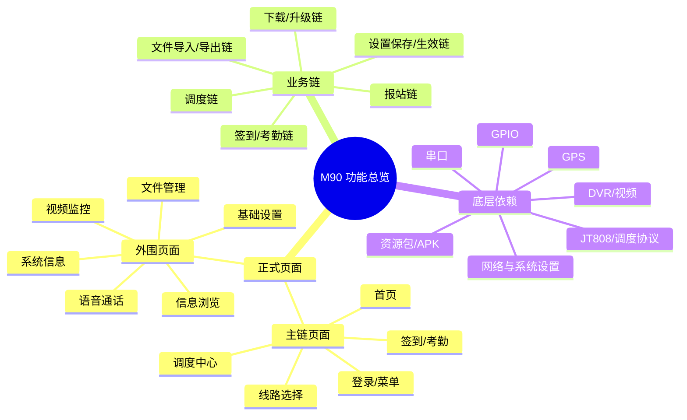
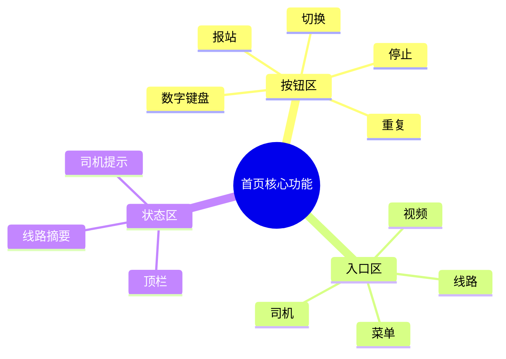

# M90 业务总图

这份文档只保留总览用途，不再承担迁移执行说明。

要推进迁移，优先看：

1. [../清单/M90对照迁移清单.md](../清单/M90对照迁移清单.md)
2. [新壳与M90差异记录.md](新壳与M90差异记录.md)

这份图只回答三件事：

1. `M90` 有哪些正式页面。
2. 页面归到哪些业务链。
3. 业务链依赖哪些底层能力。

---

## 1. M90 业务思维导图

先看主脑图，确认 `M90` 的整体业务盘子。

### 1.1 首页核心功能子脑图

这张子脑图只展开首页，单独看首页承载的核心功能块。

---

## 2. 文档分工

1. 这份图：只保留总览和接手入口。
2. [../清单/M90对照迁移清单.md](../清单/M90对照迁移清单.md)：作为迁移主单。
3. [新壳与M90差异记录.md](新壳与M90差异记录.md)：作为差异判断标准。
4. [项目架构.md](项目架构.md)：只在需要确认代码落点时再看。